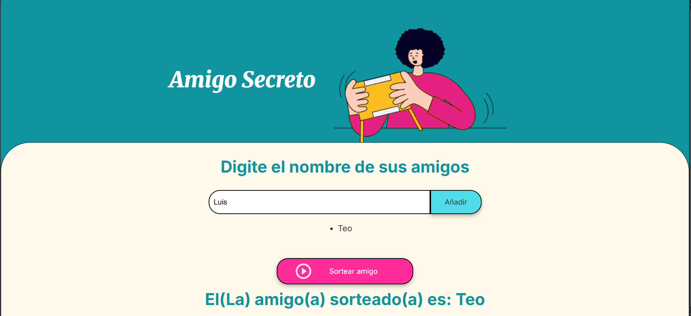

# Amigo Secreto 🎁

Este proyecto es una aplicación sencilla que recrea el clásico juego del **Amigo Secreto**.  
Permite agregar nombres de amigos a una lista y, con un solo clic, escoger uno aleatoriamente para el sorteo.

---

## 🔨 Características del proyecto

- **Añadir amigos**: Permite agregar nombres a una lista de forma dinámica.  
- **Ver lista**: Muestra todos los nombres ingresados antes de realizar el sorteo.  
- **Realizar sorteo**: Elige aleatoriamente un nombre de la lista.  
- **Interfaz sencilla**: Diseño claro y fácil de usar.

Vista previa visual del proyecto:



---

## ✔️ Tecnologías y herramientas utilizadas

- **HTML5**: Estructura básica de la página.  
- **CSS3**: Estilos y diseño visual.  
- **JavaScript**: Funcionalidad para agregar nombres, mostrar la lista y realizar el sorteo.  
- **Git/GitHub**: Control de versiones y despliegue del proyecto.

---

## 📁 Acceso al proyecto

Puedes revisar el código fuente y el proyecto completo en el siguiente repositorio:  
[Repositorio Amigo Secreto](https://github.com/Yoshi808/AmigoSecreto)

---

## 🛠️ Instrucciones para ejecutar el proyecto

1. Clona este repositorio en tu máquina local:  
   ```bash
   git clone https://github.com/Teolinlesp/desafioAmigoSecreto
