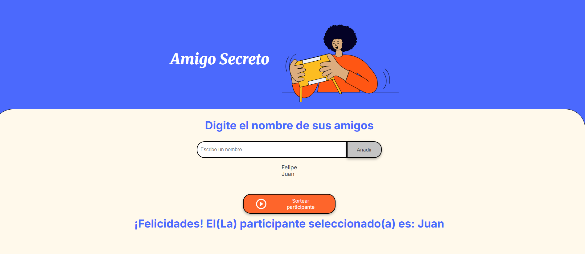

  
# Amigo Secreto 🎁

Esta es una aplicación sencilla para realizar el clásico juego del **Amigo Secreto**.  
Permite ingresar una lista de amigos y, con un solo clic, sortear aleatoriamente uno de ellos.

---

## 🔨 Funcionalidades del proyecto

- `Agregar amigos`: Permite ingresar nombres en una lista dinámica.  
- `Visualizar lista`: Muestra todos los nombres agregados antes del sorteo.  
- `Sortear amigo`: Selecciona de forma aleatoria uno de los nombres de la lista.  
- `Interfaz amigable`: Diseño intuitivo y fácil de usar.  

Ejemplo visual del proyecto:  



---

## ✔️ Técnicas y tecnologías utilizadas

- **HTML5**: estructura de la página.  
- **CSS3**: diseño visual y estilos.  
- **JavaScript**: lógica para agregar nombres, mostrar la lista y realizar el sorteo.  
- **Git/GitHub**: control de versiones y despliegue.  

---

## 📁 Acceso al proyecto

Puedes acceder al código fuente y al proyecto completo en este repositorio:  
[Repositorio Amigo Secreto](https://github.com/Teolinlesp/desafioAmigoSecreto)

---

## 🛠️ Abrir y ejecutar el proyecto

1. Clona este repositorio en tu computadora:  
   ```bash
   git clone https://github.com/Teolinlesp/desafioAmigoSecreto
